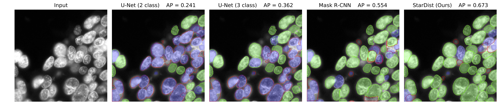

`pip install detsegtra`

Simple numpy utils for cell and blob segmentation and analysis.

Just a few of the things you can do with this library:

- Build bipartite graphs and matchings between cells
- Compute DET, SEG and TRA scores
- Make images overlaying ground truth and proposed segmentation.

